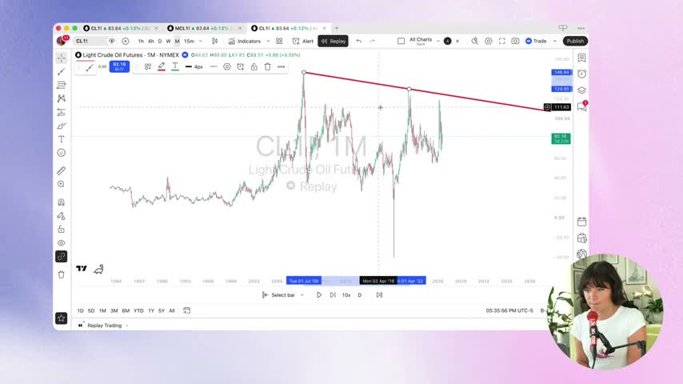
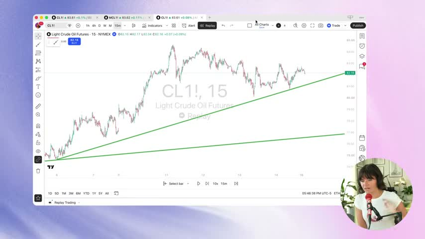
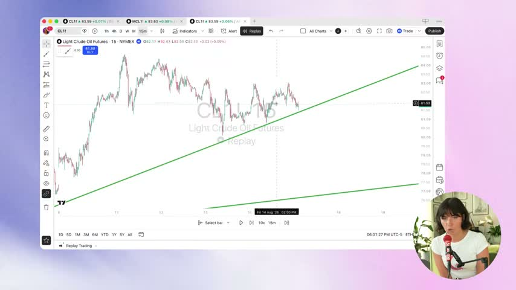
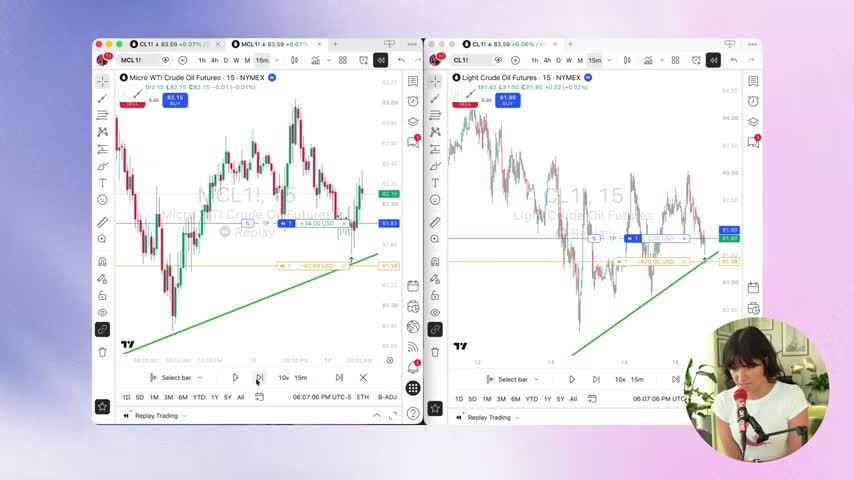
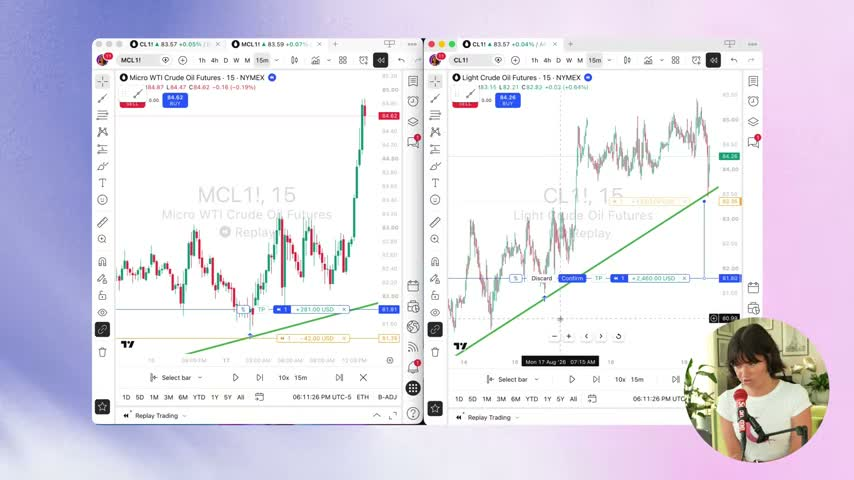
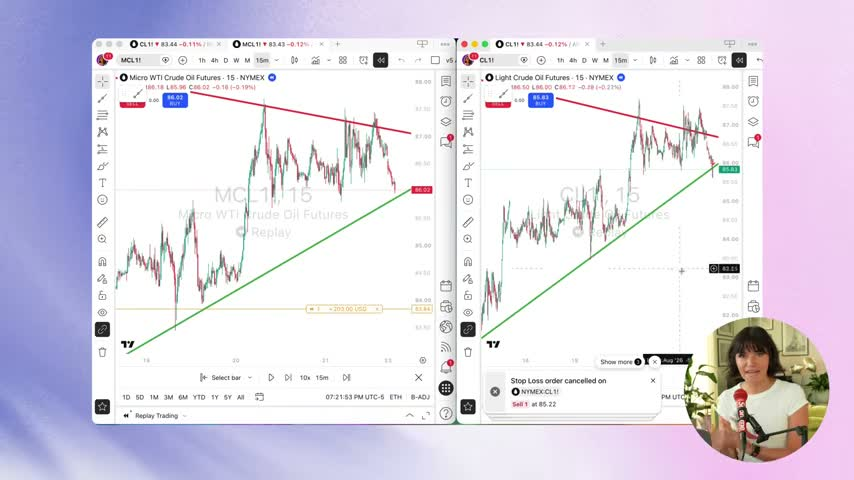

# Trendline bounce (Tori Trades): tested on NNQ

- **Source video:** "Once you master this strategy, trading becomes EASY", Tori Trades, https://youtu.be/TuXOgkcYw9E (2026-09-24, ~21 min)
- **Source analysis:** `financial_advisor/docs/2026-10-10_tori-trades-trendline-bounce-strategy.md`, which has the full condensed transcript, incentive notes and frames. This file covers only what matters for **this** project: NNQ intraday trading, the SIM rules, and the chart workflow.
- **Test:** `node scripts/trendline-backtest.js` on the saved NNQ bars in `journal/fib/` (1m 10/02–10/06, 5m 09/23–10/06, 15m 08/28–10/06). TradingView was not running on 2026-10-10, so no newer data was pulled.
- **Verdict:** **not adopted.** As she trades it, the method loses on NNQ after fees on every timeframe. No rule changes. The backtest script stays in the repo so the test can be re-run when more data exists.

## The method in four steps

1. **Lines.** Draw rays on the monthly chart: the first downtrend line from the all-time high and the first uptrend line from the all-time low. Rule 1: price may not cut through a line. Rule 2: each new line starts at the previous line's last touch.
2. **Top-down.** Repeat on W, D, 4h, 1h and 15m. Each step adds a steeper line and nudges the old lines to fit the finer bars.
3. **Entry.** When price comes back to a line and reacts, buy (for an uptrend line) with the stop **just beyond the line**.
4. **Exit.** Trail the stop under each new swing low, and close when a candle **closes** through the line. There is no profit target.

The video's evidence is **one** replay trade on crude oil (15m, mid-August 2026): +$4,000 against $420 risked on CL, about 9.5R. It shows how a trend-following exit pays when the trend is long. It shows nothing about how often the setup works: the video gives no win rate, no sample and no losing example.

| | |
|---|---|
|  |  |
| Monthly: first downtrend ray from the 2008 high | 15m after the top-down: two up-lines from one low |
|  |  |
| Entry: price back at the steeper line | Stop just below the line: $42 on MCL, $420 on CL (~0.4 pts of crude) |
|  |  |
| Stop trailed under a new swing low | Exit on a close through the line, +$4,000 |

## How it maps onto this project

| Her rule | Our rule (CLAUDE.md, SIM section) | Fit |
|---|---|---|
| Enter at the line, as close as possible | Entries are resting limits at a level, never chasing a stretched move | **Same idea.** Nothing new. |
| Stop just below the line | Stop beyond the **swing** the setup came from, ~12-15 pts past the level (rule of 2026-10-07: 1.5-2 pt wicks stopped two trades that then worked) | **Conflicts.** Her stop is our known mistake. |
| No target; trail under swing lows; exit on a close through the line | A fixed TP at a real level with net R:R ≥ 1.5 after the 14.8-pt fee; exit triggers followed exactly | **New.** This is the one part worth testing. |
| Lines drawn by eye on six timeframes | Levels from structure, ORB and prior-day levels | Partly. Her lines are discretionary: two people draw different ones. |

**The fee problem in one line:** her stop on crude is about 0.4 points. On NNQ "just below the line" is ~5 pts (1-3 pts of buffer, plus the line drifting under the fill), and one SIM round trip costs **14.8 pts**. Every stopped trade therefore loses about 4x its planned risk, and a loss of 1R really costs about 4R.

## Backtest (scripts/trendline-backtest.js)

**How the test makes her method mechanical (no look-ahead):** when a pivot low B is confirmed, it is connected to an earlier, lower pivot low A, keeping the steepest line with no close below it between A and B (rule 1). That line becomes the action line, and it dies on the first close below it. Price must first bounce `away` pts off the line. Then a resting buy limit sits at the line (+0 or +2 pts) and moves with it each bar. **Stop:** `tori` = line - 1 or 3 pts (hers), or `swing` = B - 3 or 6 pts (ours). **Exit:** the stop trails to each new pivot low confirmed after entry, and the trade closes on the first bar that closes below the line. Shorts are the mirror image. Entries only 08:45-11:30 and 12:45-14:30 CT, flat by 14:50, fees 14.8 pts, stop slippage 2 pts, and fills only when price trades 1 tick through the limit. The test swept 48 configurations per stop type and timeframe (pivot length 2/3/5, offset, bounce size, buffer, 30-pt risk cap on or off).

Pooled over every configuration (no cherry-picking), net points per trade with 1 NNQ contract:

| TF | Stop | Trades | Win % | Gross / trade | **Net / trade** | Avg risk | Trades ≥ 5R |
|---|---|---|---|---|---|---|---|
| 1m | line (hers) | 218 | 4 | -1.8 | **-16.6** | 4.9 | 8 |
| 1m | swing (ours) | 862 | 5 | -1.8 | **-16.6** | 20.3 | 2 |
| 5m | line | 604 | 5 | -3.5 | **-18.3** | 5.0 | 12 |
| 5m | swing | 1,782 | 12 | +2.9 | **-11.9** | 35.5 | 76 |
| 15m | line | 454 | 11 | +4.5 | **-10.3** | 5.0 | 44 |
| 15m | swing | 1,302 | 17 | -1.5 | **-16.3** | 48.7 | 60 |

- **Net is negative everywhere**, and every pooled 95% bootstrap interval lies **below zero**. The configurations share trades, so the true intervals are wider, but no row comes close to zero.
- **Gross is roughly zero.** Before fees the bounce barely beats a coin flip, so it is not an edge that fees happen to eat. The best gross row, 5m longs with the swing stop, made +12.9 pts per trade but averaged 40.6 pts of risk, over our 30-pt cap, and still netted -1.9.
- **The fat tail is real but too rare:** she is right that the trailing exit catches 10-20R moves (max 21R on 15m). But with win rates of 4-17%, the winners don't pay for the fee-loaded losers.
- **Best single configurations** (5m, swing stop, pivot length 5: +16.9 pts per trade over 13 trades; 15m, line stop: +0.2 over 21) are picked from 96 configurations on a few weeks of one rising market. Treat them as noise, the same as the best fib configurations on 2026-10-06.
- **Caveats:** this is one way to make a discretionary method mechanical. Her multi-timeframe line selection was not modelled; only same-timeframe pivot lines were. The sample covers one strongly rising market (15m: 29,660 → 31,520). The longs-vs-shorts split is too small to read into.

## What, if anything, to apply

- **Nothing changes in the rules.** It confirms two existing ones: (1) the 2026-10-07 stop rule, since a stop just past the line is inside NNQ's noise and below the fee; and (2) the fib finding of 2026-10-06 that on 1m/5m, **fees decide the result**, so any intraday NNQ idea has to show **gross** edge well above 14.8 pts per trade before it is worth SIM money.
- **For advice only (not a rule):** when a trade is working along a clean rising line, "trail under each new confirmed swing low, and exit on a 15m close through the line" is a sensible way to describe the invalidation in the plan. The data does not show it beats a fixed TP, so it stays a judgment call and the fixed TP with net R:R ≥ 1.5 remains the default.
- **Re-test** after more history is saved (`node scripts/fib-data.js`, run only when the user asks): `node scripts/trendline-backtest.js` (add `--fee 9.4` for LIVE costs). Only a gross edge on 15m that holds on unseen data would justify drawing these lines into the "mark entries" plans.
